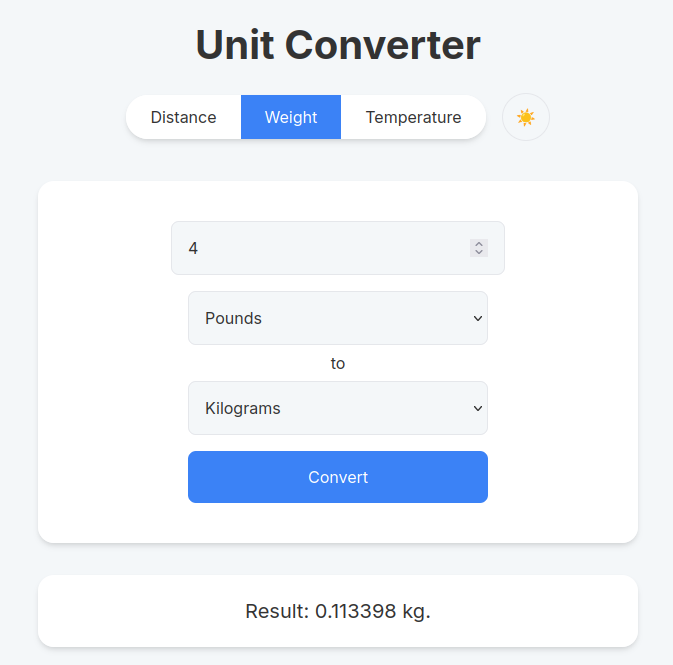
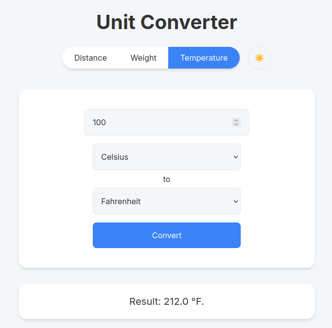
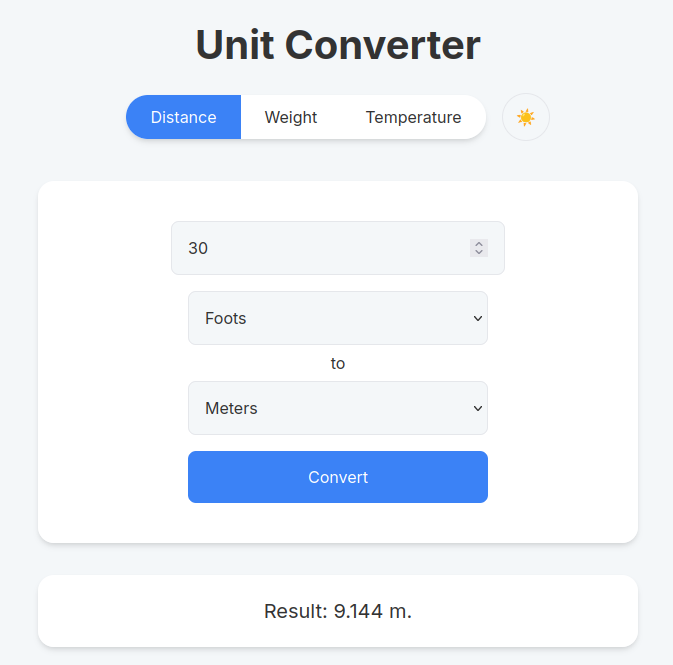
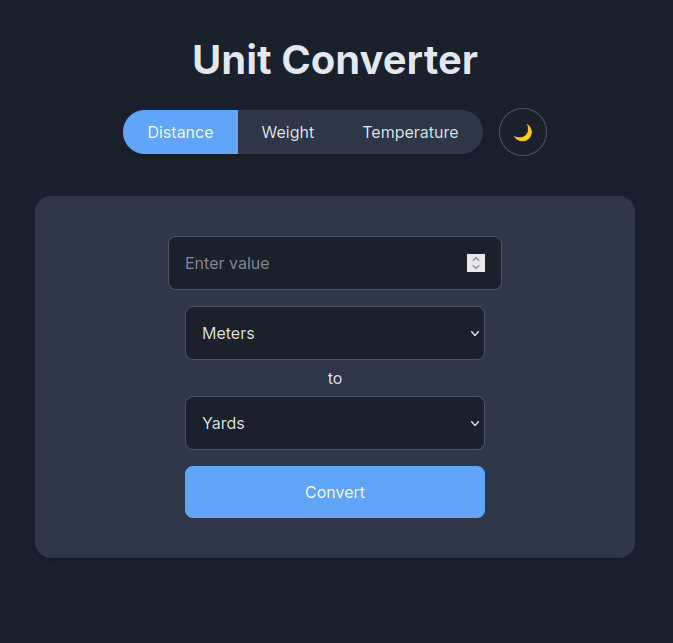

# Unit Converter


**Unit Converter** is a clean, intuitive, and user-friendly application that lets you quickly convert between different units of **weight**, **temperature**, and **distance**.

This project is based on the **Unit Converter** challenge from [roadmap.sh](https://roadmap.sh/projects/unit-converter),
with a focus on simplicity, usability, and providing a responsive **web interface** that works seamlessly on both desktop and mobile devices.

The application is built with **Java 21** and **Spring Boot**, using **Thymeleaf templates** for the web UI.
All conversions are performed in-memory, keeping the app lightweight, fast, and easy to understand.

---

## Features

* Convert **weight** units: kilograms, pounds, grams, and more.
* Convert **temperature** units: Celsius, Fahrenheit, Kelvin.
* Convert **distance** units: meters, kilometers, miles.
* Fully **responsive web interface**, accessible on desktop, tablet, and mobile devices.
* **Modern and clean UI** designed for ease of use.
* Lightweight and fast — no external dependencies required for conversions.


## How to Run It

Clone the repository:

```bash
git clone https://github.com/vekzz-dev/unit-converter.git
cd unit-converter
````

Build the project:

```bash
mvn clean package
```

Run the application:

```bash
mvn spring-boot:run
```

The web interface will be available at:

```
http://localhost:8080/unit-converter/distance
```

---

## How to Use It

### Web Interface

* Access `/weight` to convert weight units.
* Access `/temperature` to convert temperature units.
* Access `/distance` to convert distance units.

---

## Screenshots

### Weight Conversion



### Temperature Conversion



### Distance Conversion



### Dark Mode


---

## License

This project is licensed under the [MIT License](LICENSE).

